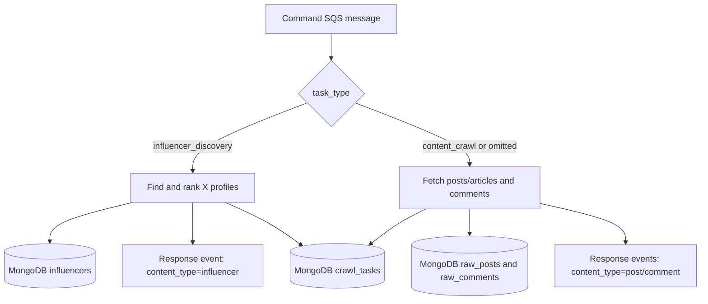

# Data-Crawler-Task

Local crawler for content and X influencer discovery. It accepts jobs over HTTP/SQS, stores posts, comments, and individual influencers in MongoDB, and optionally publishes one `raw_collected` event per item.

Pace-Unit is **not** modified; this project is a copy + API wrapper.

## Requirements

- Python 3.11+
- MongoDB (local or Atlas)
- Playwright Chromium (for X / Reddit)
- Optional: YouTube / NewsAPI / Guardian / Reddit OAuth keys

## Setup

```bash
cd Data-Crawler-Task
python3 -m venv .venv
source .venv/bin/activate
pip install -r requirements.txt
playwright install chromium
cp .env.example .env
# Fill API keys / Mongo. Or keep Pace-Unit credentials/backend.env —
# config.py loads it automatically when present (local .env overrides).
```

Run (always **one** uvicorn worker):

```bash
uvicorn app.main:app --host 127.0.0.1 --port 8000 --workers 1
```

Smoke check:

```bash
curl http://127.0.0.1:8000/health
```

## Workflow overview



The incoming command is classified by `task_type`:

- `influencer_discovery` requires `input.topic` and uses the X influencer pipeline.
- `content_crawl` requires `input.query` and uses the article/content adapters.
- If `task_type` is omitted, the message defaults to `content_crawl`.

The response queue uses a different field, `content_type`, to identify each emitted item: `influencer`, `post`, or `comment`.

## Docker

```bash
docker build -t data-crawler-task .
# Mongo on the host (Mac/Windows):
docker run --rm -p 8000:8000 --shm-size=1gb \
  -e MONGODB_URI=mongodb://host.docker.internal:27017 \
  --env-file .env data-crawler-task
```

`--shm-size=1gb` is required for Chromium. Do not use `mongodb://localhost` inside the container unless Mongo runs in the same container network.

## API

### `POST /crawl`

```json
{
  "query": "agentic AI marketing",
  "source": "all",
  "time_delta": "day",
  "limit": 2
}
```

| Field | Notes |
|-------|--------|
| `query` | Required **search keywords**. Prefer short phrases over chat questions — see [QUERY_GUIDANCE.md](QUERY_GUIDANCE.md) |
| `source` | `x` \| `reddit` \| `youtube` \| `duckduckgo` \| `news` \| `all` (omit = all) |
| `time_delta` | `1`/`7`/`30`/`365` or `hour`/`day`/`week`/`month`/`year` |
| `limit` | Max posts per adapter (default 50). Comments are included for X/Reddit/YouTube |

Response:

```json
{ "task_id": "uuid", "status": "accepted" }
```

Poll progress with `GET /crawl/{task_id}`. `GET /sources` returns the category-to-adapter map, and `GET /health` is the liveness check. Use `X-API-Key` if `CRAWL_API_KEY` is set in `.env`.

## Source categories

| Category | Adapters |
|----------|----------|
| `x` | x_playwright |
| `reddit` | reddit_playwright |
| `youtube` | youtube_api |
| `duckduckgo` | duckduckgo_web |
| `news` | google_news, bbc, techcrunch, guardian, hackernews, newsapi, reddit_official, reddit_rss |
| `all` | everything above |

Content adapters run in a thread pool. Content crawling and influencer discovery share one process-wide X gate, so only one X pipeline uses the authenticated session at a time. Non-X sources can still run in parallel.

## Sessions (X / Reddit)

Set in `.env`:

- `X_AUTH_TOKEN`, `X_CT0` from x.com cookies after login
- `REDDIT_SESSION` (optional `REDDIT_TOKEN_V2`) from reddit.com cookies

On expiry or a login wall, the task records `session_expired`, logs the error, and optionally sends an email if SMTP variables are configured.

## Influencer classification model

Influencer discovery uses a local name classifier to filter company or non-person accounts before ranking. It maps model labels such as `residential` to `person_name`, and `non_residential` or `rental` to `company_name`.

The loader expects a Hugging Face-compatible model directory at `models/name-classifier` by default. The directory must contain the tokenizer/model files required by `transformers`, and it is intentionally excluded from Git because model files can be large. To use another location, set `LOCAL_CLASSIFIER_MODEL` in `.env`. Set `CLASSIFICATION_BACKEND=none` to disable classification.

If enabling the local backend, install its runtime dependencies in the virtual environment: `pip install torch transformers sentencepiece`.

## MongoDB

Collections: `raw_posts`, `raw_comments`, `influencers`, `crawl_tasks`.

Content uses `(source, external_id)` as its unique key. Each row includes the query and may include the task ID. Influencers are upserted by normalized X handle.

X uses multi-mode search (`top` + `live`); Reddit query search is **relevance-only**. Both dedupe by post ID before comment crawling. X skips low-discussion posts on `live` (`min_replies >= 10`). The default X/Reddit comment hard cap is 200.

## Relevance eval

```bash
python -m tests.eval_relevent --query "AI trending in Marketing" --limit 10
python -m tests.eval_relevent --query "AI" --source x_playwright --json report.json
```

Requires `OPENAI_API_KEY` (model default `gpt-5.6-luna` via `EVAL_MODEL`). This crawls adapters directly and does not write to MongoDB.

## SQS

Two optional queues are supported. Both need `AWS_ACCESS_KEY_ID`, `AWS_SECRET_ACCESS_KEY`, and `AWS_REGION`.

| Queue | Environment variable | Role |
|-------|----------------------|------|
| Command | `AWS_SQS_COMMAND_QUEUE_URL` | Long-poll crawl jobs; same path as `POST /crawl` |
| Response | `AWS_SQS_QUEUE_URL` | Publish `raw_collected` after each MongoDB write |

Set `SQS_COMMAND_CONSUMER_ENABLED=0` to disable the command consumer. Omit a queue URL to skip that side. Response-publish failures become `sqs_error` warnings and do not fail the crawl.

### Content crawl command

```json
{
  "job_id": "crawl-marketing-001",
  "task_type": "content_crawl",
  "input": {
    "query": "Digital Marketing Trends",
    "source": "all",
    "time_delta": "week",
    "limit": 20
  }
}
```

The previous flat content message remains supported and defaults to `content_crawl`.

### Influencer discovery command

```json
{
  "job_id": "influencers-marketing-001",
  "task_type": "influencer_discovery",
  "input": {
    "topic": "Marketing",
    "limit": 10
  }
}
```

`job_id` becomes `task_id` (otherwise a UUID is generated). If the same ID already exists in MongoDB, the consumer skips it.

### Response event

One response message is published per item. The event identifies the item with `content_type`: `post`, `comment`, or `influencer`.

```json
{
  "event_id": "uuid",
  "schema_version": 1,
  "event_type": "raw_collected",
  "content_type": "influencer",
  "source": "x_influencer_discovery",
  "external_id": "example_handle",
  "parent_content_id": null,
  "history_id": "influencers-marketing-001",
  "occurred_at": "2026-01-01T00:00:00Z",
  "payload": {
    "topic": "Marketing",
    "name": "Example Person",
    "handle": "example_handle",
    "bio": "Marketing educator",
    "profile_img_url": "https://example.com/profile.jpg",
    "followers_count": 1200,
    "following_count": 100
  }
}
```

## Tests

### Unit tests

Run all fast, mocked/unit tests in one command:

```bash
.venv/bin/python -m unittest discover -s tests -p 'test_*.py' -v
```

This covers command-SQS classification, influencer orchestration, influencer persistence, event formats, publishers, source helpers, and session/resource behavior. Run one group when iterating:

```bash
.venv/bin/python -m unittest -v tests.test_influencer
.venv/bin/python -m unittest -v tests.test_command_sqs
.venv/bin/python -m unittest -v tests.test_events tests.test_publisher
```

### Source smoke test

Run the live adapters independently to check whether configured sources can retrieve documents:

```bash
.venv/bin/python tests/test_sources.py --query "artificial intelligence" --limit 5
```

Useful options:

```bash
# Test one source or category
.venv/bin/python tests/test_sources.py --source x
.venv/bin/python tests/test_sources.py --source newsapi --limit 3

# Test only the normal registry adapters. This checks the default fetch
# function registered for each source.
.venv/bin/python tests/test_sources.py --registry-only

# Test only alternate modes such as X live/top/profile, Reddit subreddit,
# YouTube trending, and other non-default checks.
.venv/bin/python tests/test_sources.py --extra-only

# Include slower X/Reddit comment checks
.venv/bin/python tests/test_sources.py --source x --with-comments
```

`--source` can be repeated and accepts adapter names such as `x_playwright` or categories such as `x`, `reddit`, and `news`. This test uses the network and skips sources whose credentials are missing.

### Relevance evaluation

Run the LLM-based relevance evaluator to measure whether retrieved documents match a query. It does not write to MongoDB and requires `OPENAI_API_KEY`:

```bash
.venv/bin/python tests/eval_relevent.py \
  --query "AI trending in Marketing" \
  --limit 10
```

Limit the evaluation to one or more sources and optionally save a JSON report:

```bash
.venv/bin/python tests/eval_relevent.py \
  --query "AI" \
  --source x_playwright \
  --source reddit_playwright \
  --limit 10 \
  --json eval_report.json
```

`--source` is repeatable and accepts registry names or categories. The report includes item counts, relevance percentages, mean scores, and per-document judgments.

Interpret the results as follows: `relevant=true` means the LLM judge considers the retrieved document a meaningful match to the query, `pct_relevant` is the percentage of matching documents, and `mean_score` is the average score from 1 (unrelated) to 5 (highly relevant). A crawl failure is reported separately from a low relevance score.

### Live influencer workflow

Run the real, no-mocking influencer workflow test. It uses the configured X credentials and MongoDB, takes several minutes, and writes real records:

```bash
.venv/bin/python tests/e2e_influencer_pipeline.py
```

The live test uses `topic="Marketing"` and `limit=10`, then verifies the completed task and matching MongoDB documents.

## Timeouts

Expected Playwright runtime at `limit=50` with comments can be up to roughly two hours per source. The task wall-clock timeout is `CRAWL_TASK_TIMEOUT_SEC` (default 10800 seconds / 3 hours).
